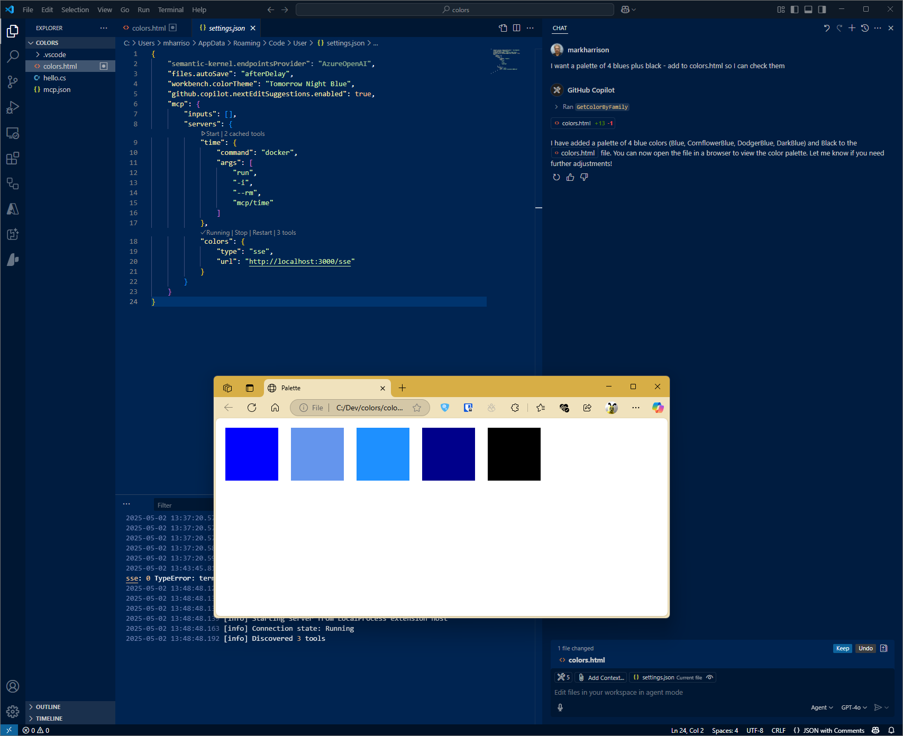

# ColorsMCP - Model Context Protocol (MCP) Server

## Overview

This is a Model Context Protocol (MCP) server implementation built with .NET 9.0. 
Both STDIO and SSE versions. 

Able to ask questions about Colors.



## Configuration STDIO

### VSCode config 

Filename:  .vscode\mcp.json

```JSON
{
    "servers": {
        "colorsserver": {
            "type": "stdio",
            "command": "dotnet",
            "args": [
                "run",
                "--project",
                "c:/dev/ColorsMCP/ColorsMCP/ColorsMCP.csproj"
            ]
        }
    }
}
```

## Configuration SSE

### Build Docker file 

```
cd <projectroot>
docker build -f colorsmcpsse/Dockerfile -t colorsmcpsse:latest .
docker images
```

### Run Docker file 

```
docker run -p 3000:8080 -p 3001:8081 -d colorsmcpsse:latest
```

### VSCode config

Filename:  .vscode\mcp.json

 ```JSON
{
    "servers": {
        "colorsserver": {
            "type": "sse",
            "url": "http://localhost:3000"
        }
    }
}
```

## Test

```
npx @modelcontextprotocol/inspector
```

