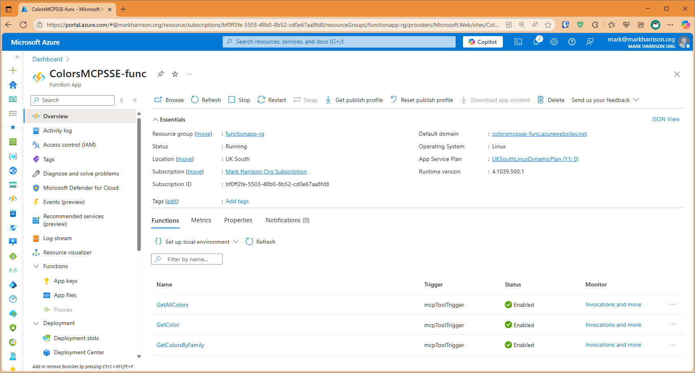
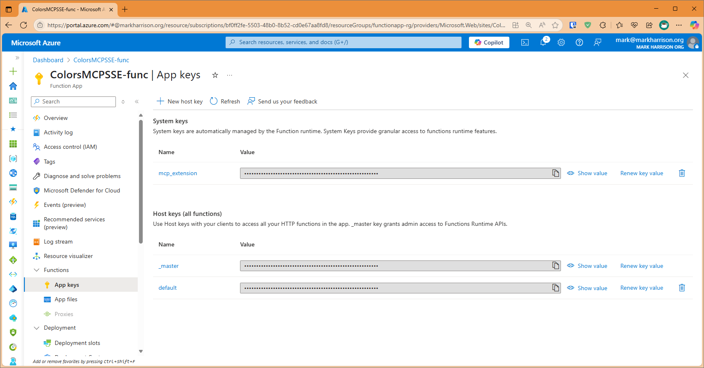
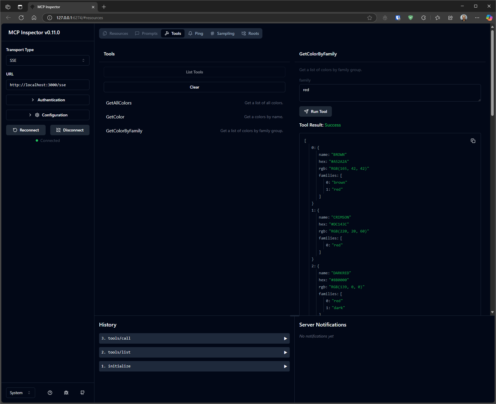

# ColorsMCP - Model Context Protocol (MCP) Server

## Overview

This is a Model Context Protocol (MCP) server implementation built with .NET 9.0. 
Projects are provided to build:
- STDIO
- Http Streamable - Docker Image
- SSE - Azure Function App

Able to ask questions about Colors.


## Configuration STDIO

### VSCode config 

Filename:  .vscode\mcp.json

```JSON
{
    "servers": {
        "colorsserver": {
            "type": "stdio",
            "command": "dotnet",
            "args": [
                "run",
                "--project",
                "c:/dev/ColorsMCP/ColorsMCP/ColorsMCP.csproj"
            ]
        }
    }
}
```

## Configuration HTTP - Docker 

### Build Docker file 

```
cd <projectroot>
docker build -f colorsmcp-http/Dockerfile -t colorsmcp-http:latest .
docker images
```

### Run Docker file 

```
docker run -p 3000:8080 -p 3001:8081 -d colorsmcp-http:latest
```

### VSCode config

Filename:  .vscode\mcp.json

 ```JSON
{
    "servers": {
        "colorsserver": {
            "type": "http",
            "url": "http://localhost:3000"
        }
    }
}
```

## Configuration SSE - Azure Function App 

### Azure Functions

There is a project to build an Azure Function App.

Note that the Url of the MCP Server will be `http://xxxxx.azurewebsites.net/runtime/webhooks/mcp/sse`.



In addition a key is needed.  This is located on Function App | Keys blade and is callled mcp_extension.

The header for this key is called `x-functions-key`.



### VSCode config

The VS Code config would look like: 

```JSON
{
    "servers": {
        "colorsserver": {
            "type": "sse",
            "url": "https://xxxxx.azurewebsites.net//runtime/webhooks/mcp/sse",
            "headers": {
                "x-functions-key": "key"
            }
        }
    }
}
```


## Test

```
$env:DANGEROUSLY_OMIT_AUTH = 'true'
npx @modelcontextprotocol/inspector
```


